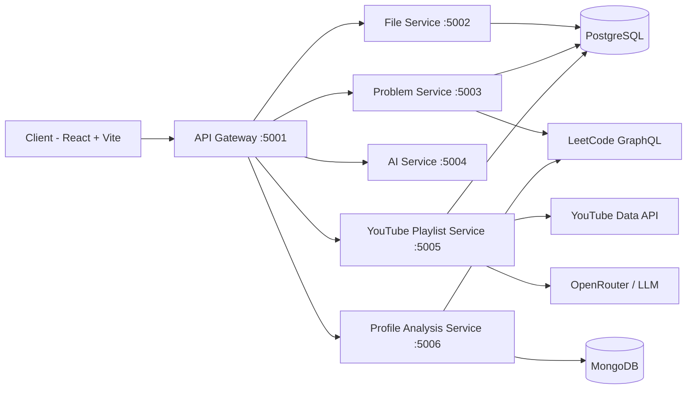
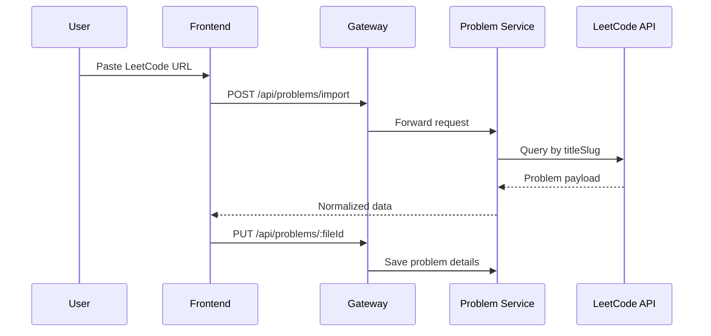
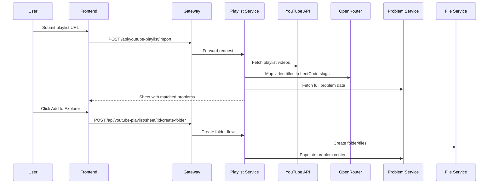

# AlgoNote AI

A full-stack DSA revision platform that helps you:
- Organize problems like a mini IDE
- Import real LeetCode questions in seconds
- Write brute/better/optimal approaches side-by-side
- Build structured revision sheets from YouTube playlists
- Analyze your profile and weak areas

---

## Why AlgoNote

Most people use scattered tools for prep: browser tabs, notes apps, spreadsheets, random repos.
AlgoNote brings everything into one workflow:

1. Discover problems
2. Solve and document approaches
3. Track revision progress
4. Generate focused practice sets

---

## Main Features

### 1. Smart Problem Workspace
- Monaco-powered code editor
- Separate tabs for Brute, Better, Optimal
- Per-problem notes
- Difficulty, tags, and metadata storage

### 2. File Explorer Style Organization
- Folder/file tree inspired by IDE explorers
- Nested structures for topics and sheets
- Rename, delete, and revision state management

### 3. LeetCode Import
- Paste a LeetCode URL
- Automatically fetch:
  - Title
  - Difficulty
  - Description
  - Starter code snippets
  - Topic tags

### 4. YouTube Playlist to Revision Sheet
- Paste a playlist URL
- System maps each video to likely LeetCode problems
- Creates a structured sheet with links and metadata
- One-click import into explorer as ready-to-practice files

### 5. Profile Analysis and Recommendations
- Analyze LeetCode profile stats
- Highlight weak areas
- Generate topic-wise recommendations
- Import weak-area questions directly into explorer

### 6. Auth + User-Scoped Data
- Clerk-based authentication in frontend
- Token-based API calls
- User-aware file tree loading

---

## System Architecture



---

## Key User Flows

### Flow A: Import LeetCode Problem



### Flow B: YouTube Playlist to Explorer



---

## Tech Stack

### Frontend
- React (Vite)
- React Router
- Zustand
- Tailwind CSS
- Monaco Editor
- Framer Motion
- Axios
- Clerk

### Backend
- Node.js + Express microservices
- API Gateway with proxy routing
- Sequelize + PostgreSQL
- Mongoose + MongoDB
- Service-to-service HTTP with Axios

### External Integrations
- LeetCode GraphQL API
- YouTube Data API v3
- OpenRouter (LLM model routing)

---

## Repository Layout

```text
.
├── client/
│   ├── src/
│   │   ├── components/
│   │   ├── pages/
│   │   ├── services/
│   │   └── store/
├── backend/
│   ├── gateway/
│   └── services/
│       ├── file-service/
│       ├── problem-service/
│       ├── ai-service/
│       ├── youtube-playlist-service/
│       └── profile-analysis-service/
├── docker-compose.yml
└── start-backend.ps1
```

---

## Quick Start

### 1. Install dependencies

```bash
npm install
cd client && npm install
cd ../backend/gateway && npm install
cd ../services/file-service && npm install
cd ../problem-service && npm install
cd ../ai-service && npm install
cd ../youtube-playlist-service && npm install
cd ../profile-analysis-service && npm install
```

### 2. Configure environment
Create required `.env` files for:
- database credentials
- API keys (LeetCode/OpenRouter/YouTube/OpenAI/Clerk as applicable)

### 3. Run locally

Backend (all services):
```bash
npm run start:backend
```

Frontend:
```bash
cd client
npm run dev
```

---

## Docker

Use Docker Compose to run the full stack:

```bash
docker compose up --build
```

Services include:
- client
- gateway
- file-service
- problem-service
- ai-service
- youtube-playlist-service
- profile-analysis-service
- mongodb

---

## API Overview

- `GET /api/files` - Fetch file tree
- `POST /api/files` - Create file/folder
- `GET /api/problems/:fileId` - Get problem content
- `PUT /api/problems/:fileId` - Update problem content
- `POST /api/problems/import` - Import from LeetCode URL
- `POST /api/ai/*` - AI operations
- `POST /api/youtube-playlist/import` - Import playlist
- `POST /api/youtube-playlist/sheet/:id/create-folder` - Push sheet to explorer
- `GET /api/profile-analysis/:username` - Analyze profile
- `POST /api/profile-analysis/recommendations` - Topic recommendations

---

## Current Direction

This project is evolving into a complete interview-prep operating system:
- structured practice generation
- integrated solving and note-taking
- feedback loops from profile analytics
- one-click revision workflows

If you are preparing for coding interviews consistently, this setup is built to reduce friction and improve repetition quality.
